# Stage 3

## Table DDLS

CREATE TABLE Airlines (
  AirlineID varchar(256) NOT NULL,
  Name varchar(256) DEFAULT NULL,
  IATA varchar(256) DEFAULT NULL,
  ICAO varchar(256) DEFAULT NULL,
  Country varchar(256) DEFAULT NULL,
  Active varchar(1) DEFAULT NULL,
  PRIMARY KEY (AirlineID)
);

CREATE TABLE Airports (
  AirportID varchar(256) NOT NULL,
  Name varchar(256) DEFAULT NULL,
  City varchar(256) DEFAULT NULL,
  Country varchar(256) DEFAULT NULL,
  IATA varchar(3) DEFAULT NULL,
  ICAO varchar(4) DEFAULT NULL,
  TimeZone varchar(256) DEFAULT NULL,
  DST varchar(10) DEFAULT NULL,
  TZ varchar(256) DEFAULT NULL,
  PRIMARY KEY (AirportID)
);

CREATE TABLE Countries (
  Name varchar(256) NOT NULL,
  ISO varchar(45) DEFAULT NULL,
  PRIMARY KEY (Name)
);

CREATE TABLE Planes (
  Name varchar(256) NOT NULL,
  IATA varchar(45) DEFAULT NULL,
  ICAO varchar(45) DEFAULT NULL,
  PRIMARY KEY (Name)
);

CREATE TABLE Routes (
  RouteID int NOT NULL,
  Airline varchar(256) DEFAULT NULL,
  AirlineID varchar(256) DEFAULT NULL,
  Source varchar(256) DEFAULT NULL,
  SourceID varchar(256) DEFAULT NULL,
  Destination varchar(256) DEFAULT NULL,
  DestinationID varchar(256) DEFAULT NULL,
  Codeshare varchar(256) DEFAULT NULL,
  Stops varchar(256) DEFAULT NULL,
  PRIMARY KEY (RouteID)
);

## Local Database Implentation:

### Local Airline Table 
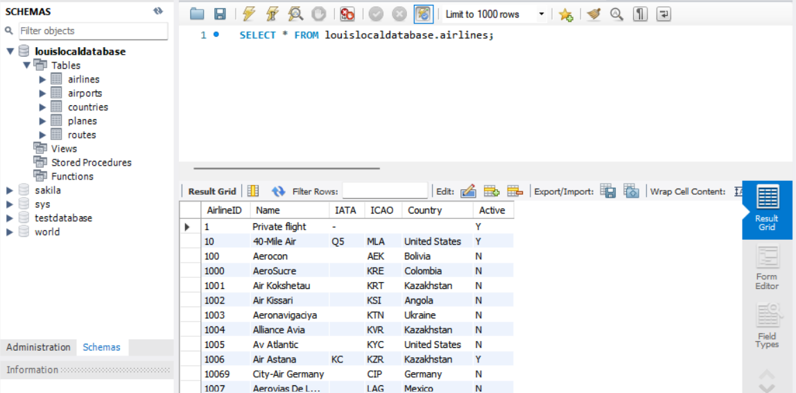

### Local Airport Table
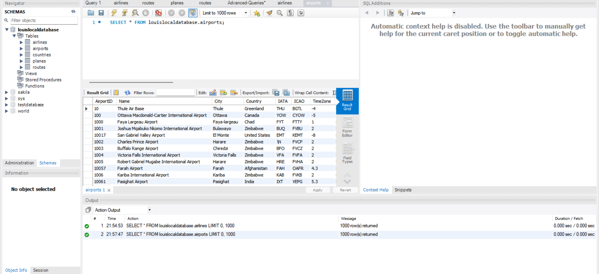

### Local Countries Table
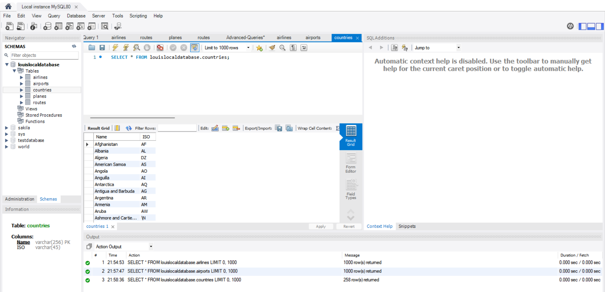

### Local Planes Table
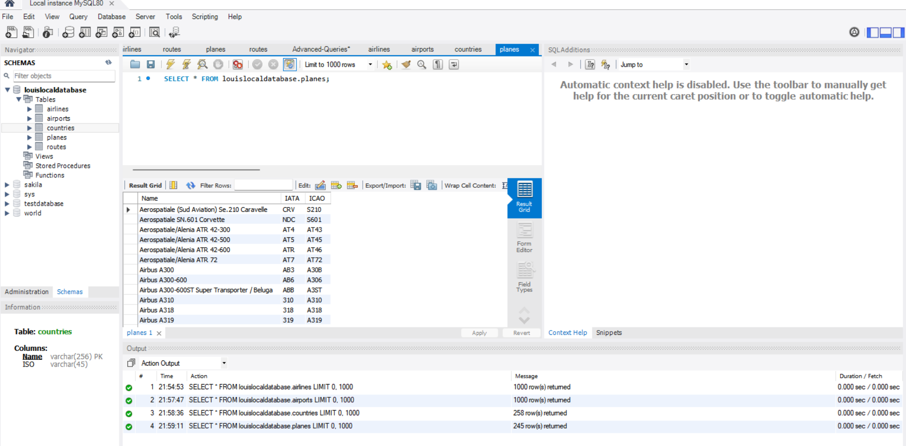

### Local Routes Table
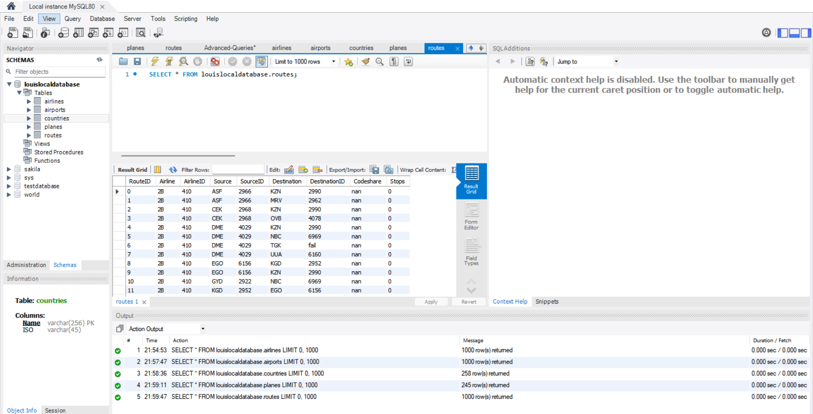

## 3 tables with at least 1000 records

### Airlines
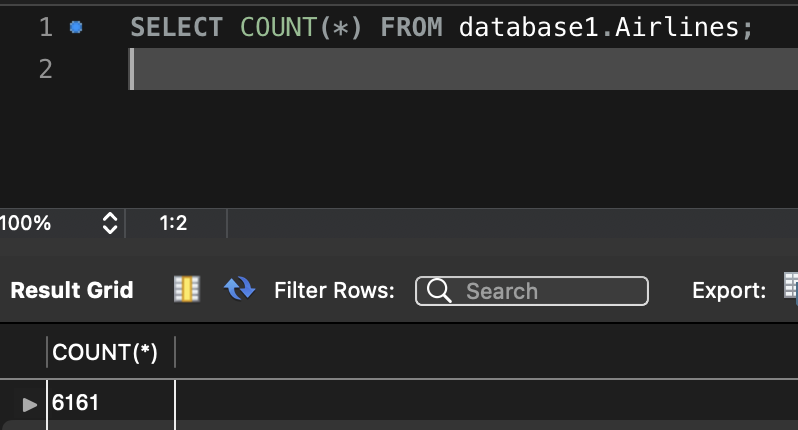

### Airports
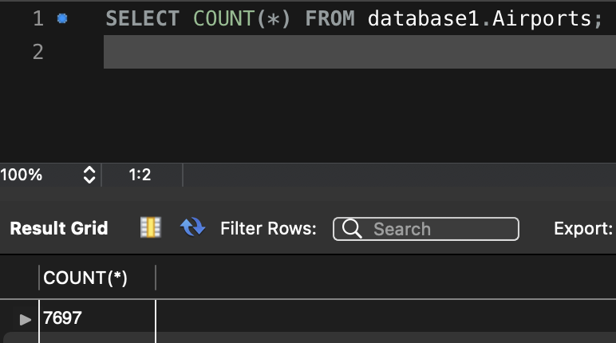

### Routes
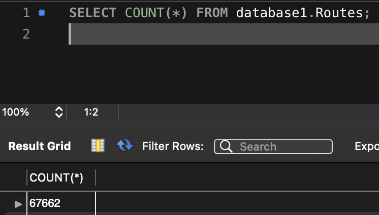

## Advanced Queries

### Advanced Query 1
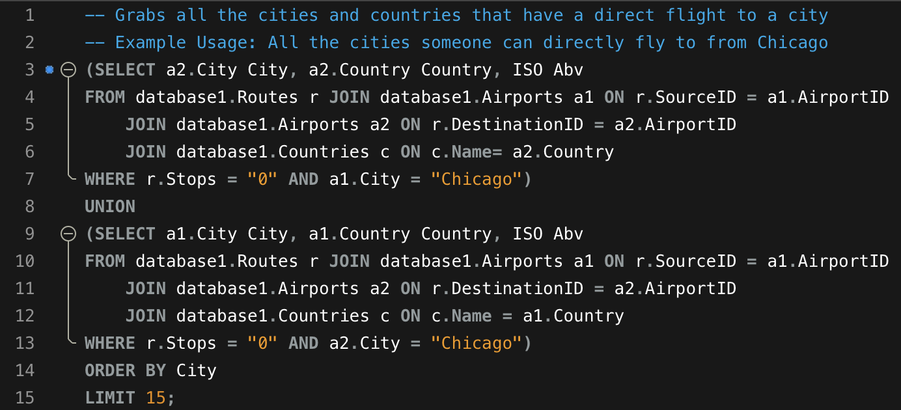
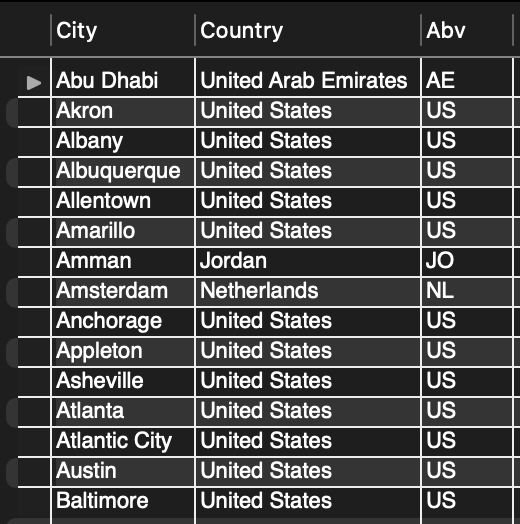

### Advanced Query 2
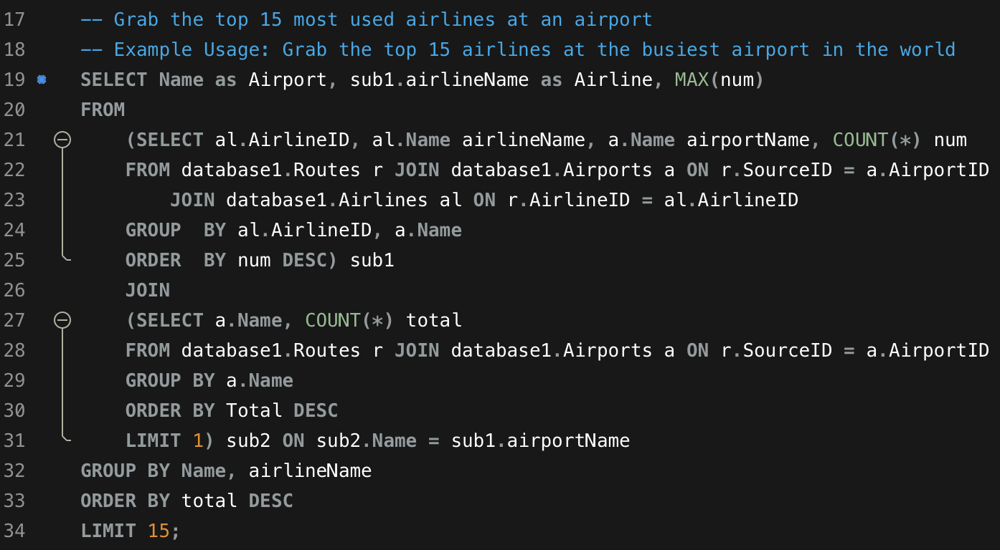
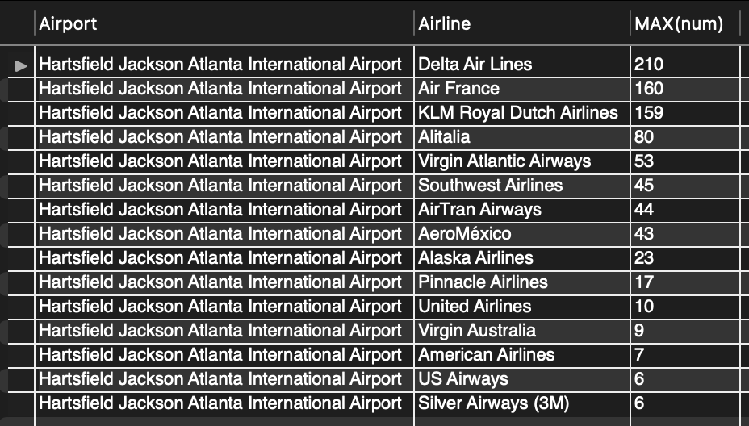

### Indexing Analysis
We created two advanced subqueries and performed an indexing analysis on both subqueries. 

**First advanced subquery before indexing**
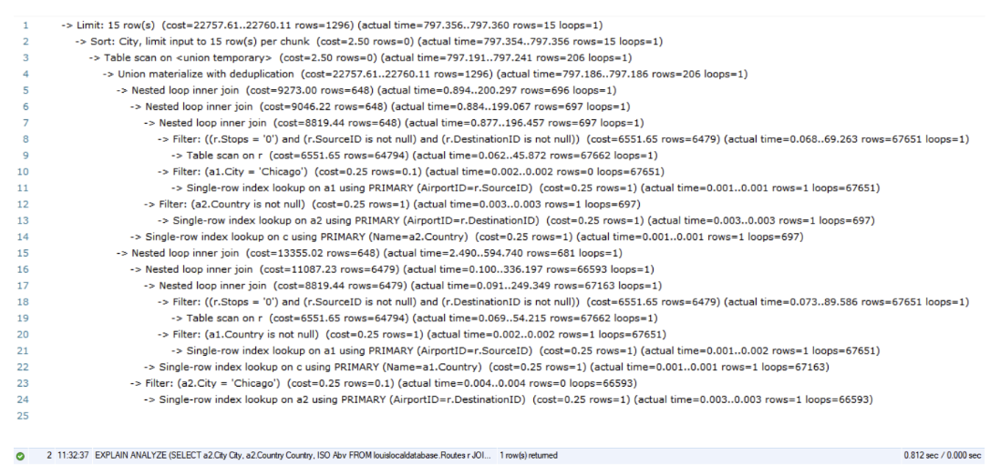

Before indexing, after running the EXPLAIN ANALYZE command, we can see that the runtime was 0.812 seconds. We considered that the runtime was too slow so we decided to optimize the runtime by indexing by two variables shown below.

**First advanced subquery after indexing airportid**
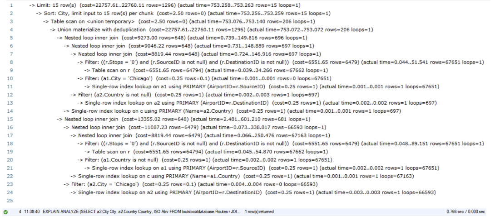

We first chose airportid because that is the primary key for airports and we did join on airport table. The runtime has been optimized to 0.766 seconds meaning that it is a good choice to index by the airport id.

**First advanced subquery after indexing routeid**
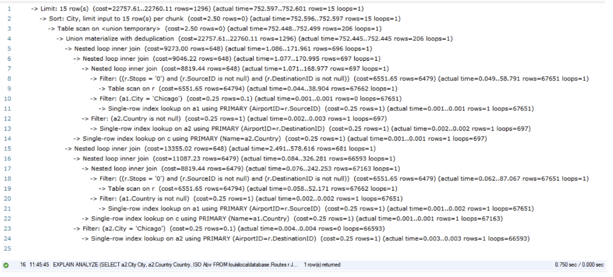

We chose routeid because it is the primary key for routes and this table contains the most data. The runtime has been optimized to 0.750 seconds meaning that it is a good choice to index by route id. 

**First advanced subquery after indexing both airportid and routeid**
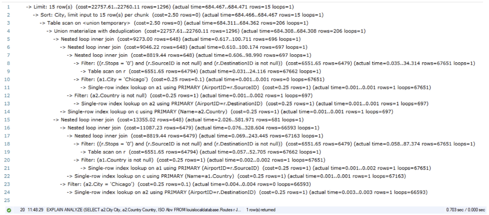

Seeing the optimized runtime by indexing each id separately, we decided to combine the indexed ids and perform runtime analysis. The good thing here is that the runtime has been optimized into 0.703 seconds. 

We combined both because we also wanted to see how the runtime would effect by combining both indexed keys.

**Second advanced subquery before indexing**
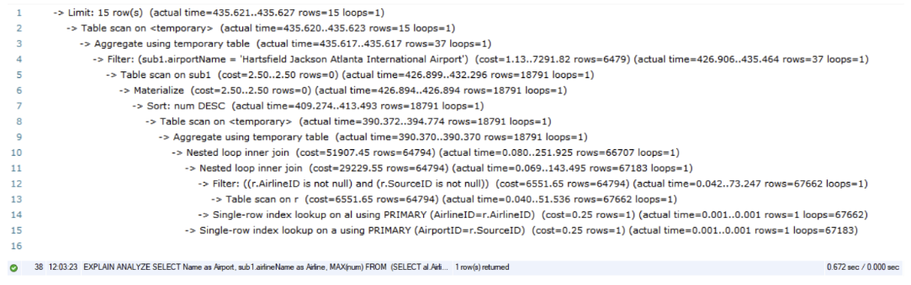

Before indexing, we can see that after running the EXPLAIN ANALYZE command, the runtime was 0.672 seconds. We considered that the runtime was too slow so we decided to optimize the runtime by indexing.

**Second advanced subquery after indexing airlineid**
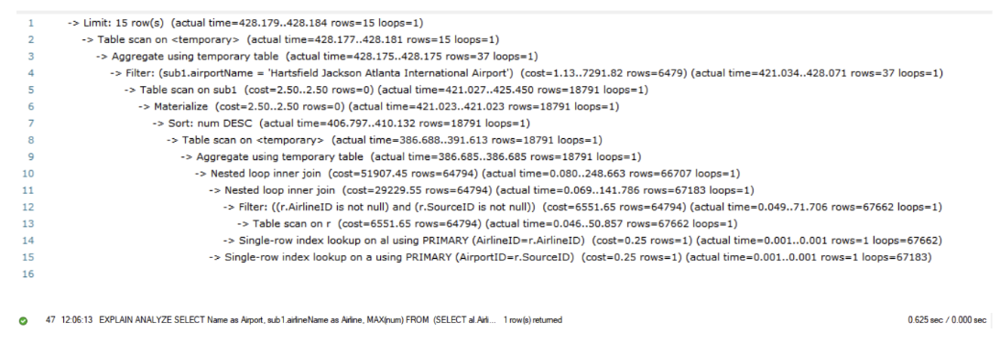

We chose airlineid because it is the primary key for airlines and this table contains all the information about airlines. The runtime has been optimized to 0.625 seconds meaning that it is a good choice to index by airline id. 

**Second advanced subquery after indexing sourceid**
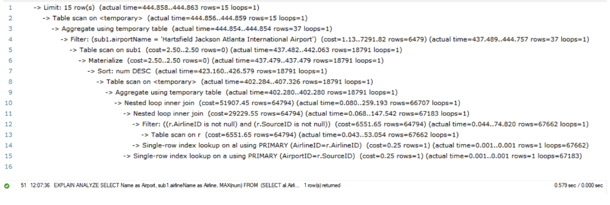

We chose sourceid because it is the primary key for airports and this table contains all the information about airports. The runtime has been optimized to 0.579 seconds meaning that it is a good choice to index by source id. 

**Second advanced subquery after indexing both airlineid and sourceid**
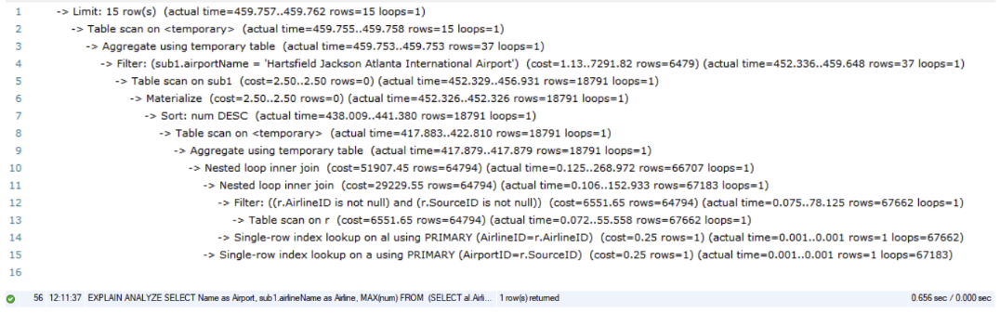

Seeing the optimized runtime by indexing each id separately, we decided to combine the indexed ids and perform runtime analysis. The good thing here is that the runtime has been optimized into 0.656 seconds. However, the best performing time was when we just indexed by the sourceid.
