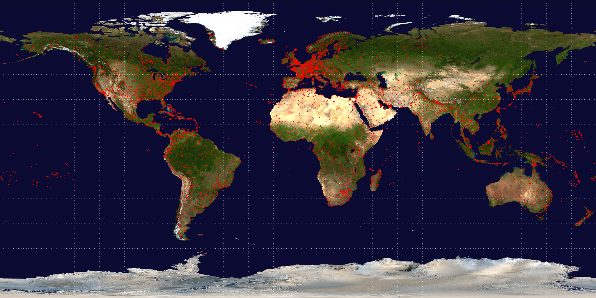
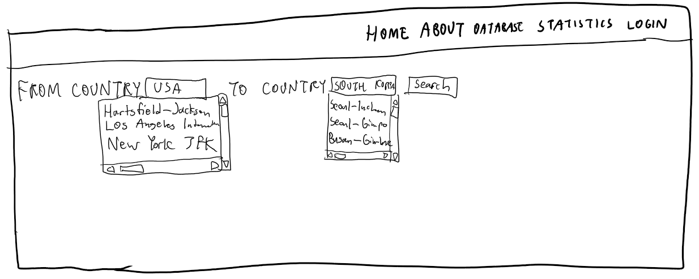
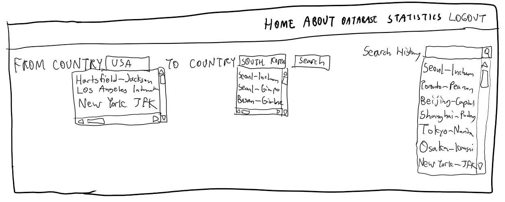

# Direct Flight Airport Connections

## Summary:
Our project is about building a website for of direct flight routes between airports.
This website will help passengers booking airline flights find out whether a direct route exists or not.
It will allow users to select countries, which our application will then group by to retrieve all the airports 
which are close to the destination they want to go to. 

## Description:
Currently whenever users would like to book a direct flight from one airport to another airport in a different location they have to look at multiple websites for different airlines to compare results. Our website will parse the routes of multiple airlines for direct flights from one airport to another. Thus, it will solve the issue for the user to check if a direct flights do in fact exist. 

## Usefulness:
There are similar websites specifically if a user types in direct flights to a location then there is a webpage developed by Google that compares flights and prices from a departure to destination airport. Our application will build upon this by letting users select a country, then doing a group by to get all the airports that are close to their desired location. After this, the user can check if there is a direct flight or not along with the respective information regarding those flights. 

## Realness:

The data will be retrieved from [OpenFlights](https://openflights.org/data.html) Airports Database. "As of January 2017, the OpenFlights Airports Database contains over 10,000 airports, train stations and ferry terminals spanning the globe, as shown in the map above." This database includes 5 primary datasets, these are: airports.dat, airlines.dat, routes.dat, planes.dat, and countries.dat. The airports dataset contains information about airports around the world, such as the name of the airport and the city and country where the airport is located. As of June 2014, the routes dataset contains information on 67663 routes between 3321 airports on 548 airlines spanning the globe. The airlines dataset contains information about airline companies, the plane dataset contains information on 173 passenger aircrafts, and the country dataset contains a list of country codes. The country dataset will be used to look up the human-readable country names for the codes used in the airline and airport tables.

## Functionality:
The website will primarily offer the user a quick way to search for airports that have direct flights. If the user chooses a country that does not have a direct flight, we will return a prompt notifying the user. Additionally, the search history will be saved in a history table which can be cleared by the user. The user must have login credentials to save their search history.

The data stored in the database will include all information from the datasets described above. The database will have tables for login information, search history, airports, airlines, routes, planes, and countries.

The creative component would be adding a dedicated statistics section on the two regions they selected. In this statistical section we could look to add APIs that could include more data for these airports/countries beyond the provided dataset data. For example we could include average flight times or the average price of airline tickets to these countries.

## Basic UI mockup:
For the basic UI mockup, we will create a website that contains multiple tabs leading to different sections (i.e. home, about, database, login page)
The homepage will display the title of the project using a typescript feature. The about page will provide a short description 
on what the website is about and the summary of the project description. The database page will provide all the data and a 
small search bar for the users to type in the airports they want to look for. It will allow users to search flights departing location to arriving location. If a user
is logged in and already created an account for the website, they will be allowed to see their history of the airports they have searched and allow to clear the searches as well. The login page will also contain a section where
returning users can log in and new users can sign up. The additional statistics part we are planning to add later if we have time
will have data visualization parts of all the dataplots and the machine learning model we might use to analyze airport data.

The image above shows what the homepage will look like for the web app.

The image above above shows what the database page will look like.

The image above above shows what the database page will look like once the user is logged.

## Work distribution:
Our plan for the work distribution is we have 2 people doing the front-end work and 2 people doing the backend work for the project. This means that mainly 2 people will be creating the database and making functions where one part is parsing the data and creating the SQL table for the database system. The remaining 2 people will create a webpage which includes all the features (i.e home, about, database, login page etc) and connect the backend as well. All team members will be helping each other if anyone gets stuck.

